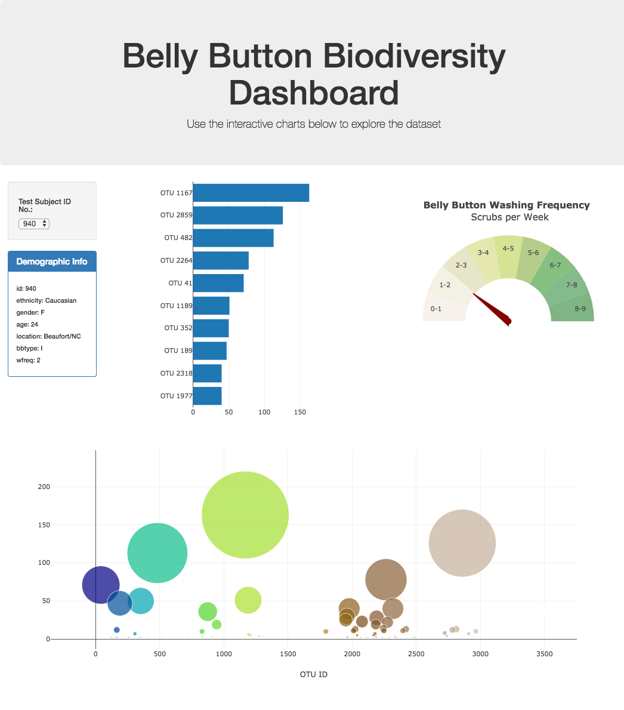

# Unit 14 Homework: Belly Button Biodiversity

In this assignment, an interactive dashboard was built to explore the [Belly Button Biodiversity dataset](http://robdunnlab.com/projects/belly-button-biodiversity/), which catalogs the microbes that colonize human navels.

The dataset reveals that a small handful of microbial species (also called operational taxonomic units, or OTUs, in the study) were present in more than 70% of people, while the rest were relatively rare.

# Layout Description of Git Hub Repository

The StarterCode folder contains the index.html and the samples.json file.

Within the StarterCode folder, the static/js folder contained the app.js folder that displays the Java Script code used to generate the dashboard.

The Images folder contain example images of the dashboard that has been generated.

## Instructions

The following was done to create the dashboard using Java Script and HTML:

1. The D3 library was used to read in `samples.json` from the URL `https://2u-data-curriculum-team.s3.amazonaws.com/dataviz-classroom/v1.1/14-Interactive-Web-Visualizations/02-Homework/samples.json`.

2. A horizontal bar chart with a dropdown menu was created to display the top 10 OTUs found in that individual.

  * `sample_values` were used as the values for the bar chart.

  * `otu_ids` were used as the labels for the bar chart.

  * `otu_labels` were used as the hovertext for the chart.

  

3. A bubble chart that displays each sample was created.

  * `otu_ids` were used for the x values.

  * `sample_values` were used for the y values.

  * `sample_values` were used for the marker size.

  * `otu_ids` were used for the marker colors.

  * `otu_labels` were used for the text values.

4. The sample metadata, i.e., an individual's demographic information was displayed.

5. Each key-value pair from the metadata JSON object was displayed.

6. The plots were updated when a new sample was selected.

- - -

## References

Hulcr, J. et al. (2012) _A Jungle in There: Bacteria in Belly Buttons are Highly Diverse, but Predictable_. Retrieved from: [http://robdunnlab.com/projects/belly-button-biodiversity/results-and-data/](http://robdunnlab.com/projects/belly-button-biodiversity/results-and-data/)

- - -

© 2022 Trilogy Education Services, a 2U, Inc. brand. All Rights Reserved.
